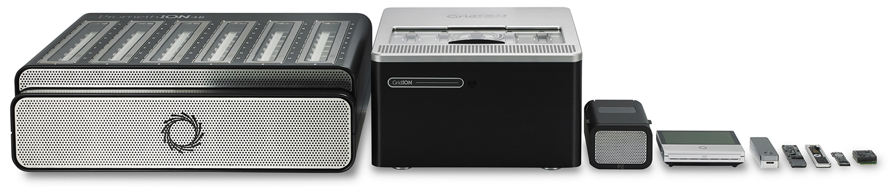
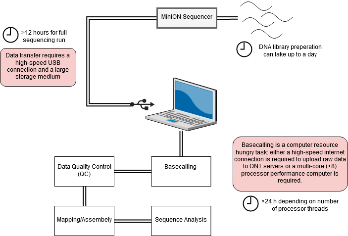

# Nanopore sequencing base calling and quality control

## Introduction

In this session we are going to be looking at data generated by third-generation nanopore sequencing technology. Developed by Oxford Nanopore Technologies (ONT), these platforms, rather than the next-generation 'sequencing-by-synthesis approach', make use of an array of microscopic protein ‘pores’ set in in an electrically resistant membrane which guide strands of DNA or RNA through them. Each nanopore corresponds to its own electrode connected to a channel and sensor chip, which measures the electric current that flows through the nanopore. When a molecule passes through a nanopore, the current is disrupted to produce a characteristic ‘squiggle’. The squiggle is then decoded using basecalling algorithms to determine the DNA or RNA sequence in real time. Oxford Nanopore’s most popular platform is the MinION which is capable of generating single reads of up to 2.3 Mb (2.3 million bases).

  

The MinION is one of 5 scalable platforms developed by ONT. High-throughput applications such as the GridION and PromethION use an array of nanopore flowcells to produce between 5 to 48 times more data than the MinION alone – outputting up to 48 TB of data in one run. More downscaled solutions such as The Flongle and SmidgION use a smaller, single flowcell to generate data. The MinION is a highly portable sequencing platform, about the size of a large USB flash drive. This technology enables researchers to perform sequencing analyses almost anywhere, providing they have the correct equipment to prepare the DNA libraries and analyse the output data. 

 

A complete sequencing run on the MinION platform can generate as much as 1 terabyte of raw data, and downstream analyses require a significant amount of compute power – multicore high performance processors and large amounts of RAM. This poses a significant logistical challenge for researchers who want to take advantage of the platform’s portability aspect. Over recent years, the integration of [GPUs](https://en.wikipedia.org/wiki/Graphics_processing_unit) (graphics processing units) in to analysis workflows has sped up applications involving machine learning greatly. 

 

## Activity Briefing
Today we will be working with example data, as detailed in the [data](/bioinformatics/data) section. Today, we are going to take this raw data and generate some insights to help further understand your MTB samples.  In this session today, we will:

* Basecall your data, transforming it from squiggle to bases.
* Perform quality control on the data, ensuring our data is of sufficient quality for analysis.
* Map the reads to a reference genome, producing three genomic 


## Basecalling
To convert the raw data output produced by the MinION sequencing run in to a usable form we need to perform a process called basecalling. This converts the raw electronic signal which is collected as the DNA passes through the pore, in to base reads – A, C, T or G. To do this we will use a program called Guppy – a software package designed by ONT which uses [recurrent neural nets (RNN)](https://en.wikipedia.org/wiki/Recurrent_neural_network) to interpret the raw signal, which comes in a proprietary '.fast5' format file produced by the sequencer software and convert it in to the standard .fastq format, for use downstream in our pipeline. Users also have the choice of using the experimental [Dorado](https://github.com/nanoporetech/dorado) basecaller which gives the option of training specialised models for specific basecalling applications. As mentioned above, GPUs are used to accelerate the basecalling process. Without a GPU performing basecalling becomes a very slow process, therfore it is advised that users procure a machine with a compatable Nvidia GPU (more information on this here).

 

Activate the relevant conda environment, navigate to the `~/data/example_data/` basecalling folder in the home directory, and we’ll start the first step.
!!! warning "Important"
    Every time you open a new terminal window, you must re-activate the nanopore conda environment.
    conda activate nanopore

```
conda activate basecalling
```

```
cd ~/data/example_data/basecalling/fast5 
```

Use the `ls` command to see what is inside this folder. Use `head` to preview one of the fast5 files. As you might find, it's completely unreadable. This is because at this stage, the data is in a binary format representing the squiggle signal we spoke about previously. We need to basecall this data before we can use it.

 Basecalling can be performed in a number of ways. There is an option to perform this while sequencing in the MinKNOW GUI, however this software provides fewer options in the ways basecalling can be completed. Here, we will use Guppy for maximum flexibility. Since the machines we are working on do not have a GPU available we will have to use the two CPU cores available to us. Therefore, we will only basecall a subset (<1%) of the dataset as an example, and in the subsequent steps we will use a pre-basecalled output. Copy the whole line in to the terminal and execute the command:

```
guppy_basecaller --config ~/bin/ont-guppy-cpu/data/dna_r9.4.1_450bps_fast.cfg --trim_adapters --detect_barcodes --compress_fastq  --input_path ~/data/example_data/basecalling/fast5  --save_path ~/data/example_data/basecalling/fastq
```

We used the the dna_r9.4.1_450bps_fast model for basecalling as this data was generated with a r9.4.1 chemistry, we also using a model which runs fast but produces lower accuracy data. The model should be adjusted based on the chemistry (e.g. r10.4.1) and the desired speed (fast, higher and superior accuracy). A number of models are listed below.

|Model|Accuracy |Chemistry|Flow cell|
|:----|:----|:----|:----|
|dna_r9.4.1_450bps_fast.cfg|Low|Kit 9|R9.4.1|
|dna_r9.4.1_450bps_hac.cfg|Med|Kit 9|R9.4.1|
|dna_r9.4.1_450bps_sup.cfg|High|Kit 9|R9.4.1|
|dna_r10.4.1_e8.2_400bps_fast.cfg|Low|Kit 14|R10.4.1|
|dna_r10.4.1_e8.2_400bps_hac.cfg|Med|Kit 14|R10.4.1|
|dna_r10.4.1_e8.2_400bps_sup.cfg|HIgh|Kit 14|R10.4.1|


You should now see the bascalling process begin, and a progress bar appear. This may take some time depending on the performance of your machine.

When the process in completed, you will find the basecalled reads in a .fastq formatted file. Navigate there by typing the following in to the terminal:  

```
cd ~/data/example_data/basecalling/fastq/pass
```

Use the `ls` command to see what is inside this folder. This directory holds several folders - one for each barcode found by guppy. Each of these folders contains the fastq formatted 'pass' reads from the basecalling process. The reads have a quality score > 7. Use  `zcat FILENAME | head` (remebering to use the correct filename) to preview the compresssed fastq file. Unlike the fast5 files, these are human-readable and contain all of the read data required for downstream analyses. Can you identify any of the common elements of a **.fastq** format files - similar to the ones you may have encountered in previous sessions? Click here to find out more about the [FASTQ](https://en.wikipedia.org/wiki/FASTQ_format) format.


## Basecalling - Quality Control
Before moving on to the analysis steps, it is important to gauge the quality of your sequencing output. There are numerous factors which dictate the quality of the output data, spanning between quality of the input material, library preparation to software and hardware failure. We will look at some important metrics produced by the sequencer which will give us a feel for how well the run went.
In order to get the run metrics in to a useful form, we will use an pycoQC to produce a range of plots in a HTML output, which we will use to judge the quality of the sequencing run. Something to note, is that in this activity we will only use a small subset of the sequenced reads, or else the analysis would take all day. This subsetting means that the sequencing telemetry may look inconsistent, when compared to a full run.


```
pycoQC -f ~/data/example_data/basecalling/fastq/.sequencing_summary.txt -o ~/data/example_data/basecalling/fastq/pycoqc_results.html
```

After executing the command you should find a file called 'pycoqc_results.html'. Open them up in the file manager or in the terminal (with the below command) and inspect some of the plots and see what you can find out. As mentioned, the data here are only a small subset of reads, so some of the plots are incomplete. But this should give you a good idea of how this analysis should look.
        
```
firefox ~/data/example_data/basecalling/fastq/pycoqc_results.html
```

Before continuing, quit firefox by clicking the X in the top right corner of the web-browser window.

!!! question "Exercise 1"

    === "Question 1"
        Approximately how long did the sequencing run take?

    === "Answer 1"        
          
        You can find the answer in the 'General run summary' table.
        
        48.06 hours
            

!!! question "Exercise 2"

    === "Question 2"
        What is the N50 of the *passed* reads (>Q7) for all basecalled reads in this run?

    === "Answer 2"        
          
        Try looking at the table at the top of the pycoQC report. Be sure to find the 'Passed' read section.
        
        1990
          


## Adapter Trimming
Nanopore library preparation results in the addition of a sequencing adapter at each end of the fragment. Both the template and complement strands to be sequenced carry the motor protein which means both strands are able to translocate the nanopore. For downstream analysis, it is important to remove these adapters. For this we will use Porechop. This program processes all of the reads in our basecalled fastq file, and removes these adapter sequences. Furthermore, the ligation library prep process can result in conjoined reads, meaning an adapter will be found in the middle of an extra-long read. Porechop will identify these, split them and remove the adapters. In addition, if you use a multiplexing kit to maximise sample throughput, this program will split the reads based on the molecular barcode added to each sample. Our dataset only has one sample, so this demultiplexing won't be necessary. 

Let's launch porechop and remove the adapters from the basecalled fastq file of barcode01.

```
cd ~/data/example_data/basecalling/fastq

porechop -i ~/data/example_data/basecalling/fastq/pass/barcode01 -o barcode01.porechop.fastq
```

Read the output of the terminal to understand better what porechop is doing to the dataset. Ask a demonstrator if you have any questions about this.

## Kraken QC

Another method of quality control is to check our reads for sequence contamination from other 'off-target' organisms. This is important in order to firstly, understand how effective your DNA extraction, enrichment and sequencing was. And secondly, to prevent anomalous reads from being incorporated in to assemblies.
Using our basecalled reads we will perform an analysis using Kraken. Kraken is a tool which sifts through each read in a .fastq file and crosschecks it against a database of microorganism genomes. The output is a taxonomic assignment of each read, enabling to identify if any contamination has occurred. In this case we will be looking for any reads which do not belong to the Plasmodium knowlesi genome.
Let’s navigate to the kraken folder to begin the analysis:

```
cd ~/data/example_data/kraken
```

The following line of code is composed of these elements:

* `kraken2` – calling the kraken2 executable
*  `--db ~/tb-kraken` - this points kraken to a vast sequence database of relevant microorganisms to cross-check our reads against
* `--output temp.krak` – this argument locates the output file
* `WT.porechop.fastq.gz` – this argument locates the input file
        
As before, to save time, we will run Kraken on only one sample. Type the following command in to the terminal to unleash the Kraken:

```
kraken2 --db ~/tb-kraken --output sample1.koutput.txt ~/data/example_data/sample1.fastq.gz
```

This file isn't particularly easy to interpret, so we will use a program called Recentrifuge to transform these data in to a more human-readable format.

```
rcf -k sample1.koutput.txt -o sample1.rcf.html --nodespath ./taxdump
```

Try opening the HTML file generated by recentrifuge in a web browser, what can you tell about the sequencing run? Was is successful? Note - due to constraints with the virtual machine, we have generated an alternative report, which can be loaded using the below command. Copy and paste it in to the terminal. If you have any questions about this, ask a demonstrator.

```
firefox sample1.rcf.html
```           


!!! question "Exercise 3"

    === "Question 3"
        Run this analysis for sample 2. Can you see any contaminating reads? What organism(s) is/are there?

    === "Answer 3"        
          
        Looks like we have a mixture of *M. intracellulare* and *M. tuberculosis*. Why do you think this might be?


!!! info "Cheat sheet"
    ```
    conda activate basecalling
    cd ~/data/example_data/basecalling/fast5 
    guppy_basecaller --config ~/bin/ont-guppy-cpu/data/dna_r9.4.1_450bps_fast.cfg --trim_adapters --detect_barcodes --compress_fastq  --input_path ~/data/example_data/basecalling/fast5  --save_path ~/data/example_data/basecalling/fastq
    cd ~/data/example_data/basecalling/fastq/pass
    pycoQC -f ~/data/example_data/basecalling/fastq/.sequencing_summary.txt -o ~/data/example_data/basecalling/fastq/pycoqc_results.html
    firefox ~/data/example_data/basecalling/fastq/pycoqc_results.html &
    cd ~/data/example_data/basecalling/fastq
    porechop -i ~/data/example_data/basecalling/fastq/WT.fastq.gz -o WT.porechop.fastq
    cd ~/data/example_data/kraken
    kraken2 --db ~/tb-kraken --output sample1.koutput.txt ~/data/example_data/sample1.fastq.gz
    rcf -k sample1.koutput.txt -o sample1.rcf.html --nodespath ./taxdump
    firefox sample1.rcf.html &
    kraken2 --db ~/tb-kraken --output sample2.koutput.txt ~/data/example_data/sample2.fastq.gz
    rcf -k sample2.koutput.txt -o sample2.rcf.html --nodespath ./taxdump
    firefox sample2.rcf.html &
    ```
