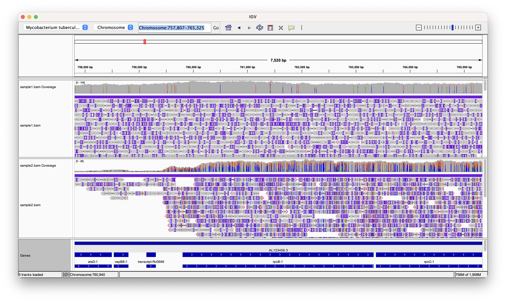
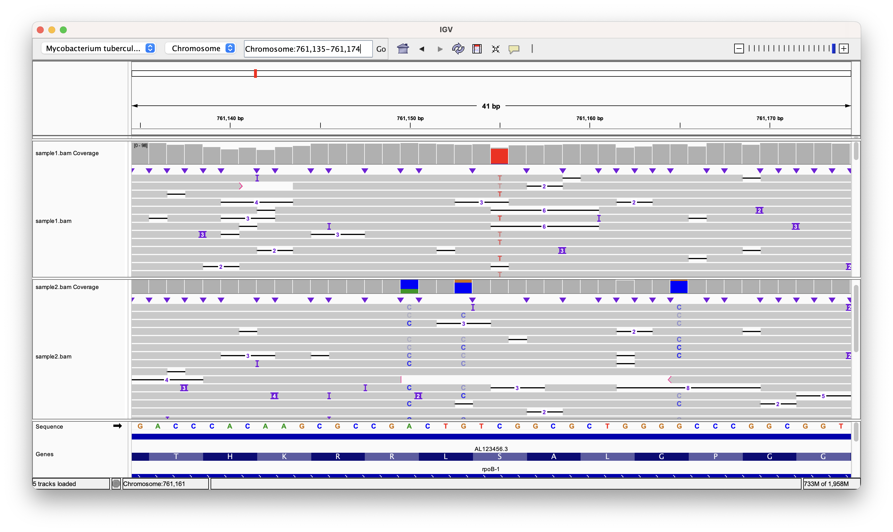

# Aligning reads

## Intended learning outcomes

This practical session goes into how to align long-read sequencing data from ONT to a reference genome:

1. Define the process of mapping sequence data
2. Describe the different softwares used in the process
3. Apply the commands to new data

## Background

Aligning short reads from next-generation sequencing platforms such as Oxford Nanopore Technology (ONT) to a reference genome is an essential step in the data analysis pipeline for several compelling reasons. Firstly, ONT generates millions of reads, typically around a couple of kb in length, making them challenging to interpret individually. By aligning these reads to a reference genome, we can accurately map each read's origin and reconstruct the underlying genomic sequence. This process enables the detection of genetic variations, such as single-nucleotide polymorphisms (SNPs) and structural variants, aiding in the understanding of genetic diversity and finding important mutations such as those that casue resistance.

!!! info
    Usually we refer to the alignment of reads to a reference as **mapping**. You might see these used interchangebly in the literature and in protocols.

To perform mapping of the reads we need to use a reference genome. Mycobacterium tuberculosis (Mtb) does not have a large amount of genomic diversity compared to other bacteria and for most purposes we can use the sequence of the H37Rv lab strain which was published in 1998 by Cole et al[^1]. We have downloaded the reference sequence for you and have put it in the `~/refgenome/` directory under the name `tb.fasta`.

The FASTA format is a widely used text-based file format for representing biological sequence data. It is named after the program FASTA, which introduced this format for sequence similarity searching. In a FASTA file, each biological sequence (DNA, RNA, or protein) is represented by two parts: a single-line sequence identifier, beginning with the ">" symbol, followed by a multi-line sequence data section. The sequence data contains the actual string of letters representing the sequence itself. FASTA format is simple, human-readable, and allows for easy exchange of biological sequence data among researchers and bioinformatics tools. Its versatility and popularity make it an essential standard for storing and sharing genetic and protein sequence information in various bioinformatics applications and databases.

!!! question "Exercise"
    
    === "Question"

        Try to use the skills you learned in the into to linux session to take a look at the fasta file and check it matches the description above.

    === "Answer"

        You can use the `head` command to look at the file
        ```
        head ~/refgenome/tb.fasta
        ```

Let's find out some more about the TB sequence. We can use a tool called `seqkit` for this, this will give you basic information such as the length of sequence and the number of sequences.

```
seqkit stats ~/refgenome/tb.fasta
```

!!! question "Exercise"
    
    === "Question"

        What is the length of the genome sequence?

    === "Answer"

        You should be able to see that the "sum_len" column reports 4,411,532 which is the number of basepairs in the genome of Mtb.

The sum_len, min_len, avg_len and max_len columns all report the same value because there is only one sequence in the tb genome. These columns are more useful to look at when analysing files with multiple sequences, for example, the fastq files we get from the minION.

The basecalled data is in the `~/data/example_data` folder. Change the working directory to where the data is using the the following command:

```
cd ~/data/example_data
```

Then activate the right conda environment:

```
conda activate mapping
```

!!! question "Exercise"
    
    === "Question"

        What is the mean length of the reads for the different samples?
        Which sample has the most reads?

    === "Answer"

        You can use seqkit to find this by running:
        
        ```
        seqkit stats *.fastq.gz
        ```

        This will give you the stats for all four files. Sample1 has the most reads with 278,337 reads.

        
!!! info
    The asterisk ("*") represents zero or more characters. When used in commands, it matches any sequence of characters. In the example above it matchs all files with a ".fastq.gz" extension, regardless of the filename's prefix or length. You can try this out by running the following command:

    ```
    echo *.fastq.gz
    ```

## Software

### Minimap2

We are now going to align our reads to the H37Rv reference using a tool called `minimap2`, which is a versatile and efficient sequence alignment tool primarily used for mapping DNA or RNA sequences against reference genomes. It is designed to handle long-read sequencing data, which is generated by technologies like PacBio or Oxford Nanopore. To perform its alignment tasks, Minimap2 requires the following inputs:

1. Query Sequences: These are the sequences that you want to align to the reference genome. Query sequences can be in FASTA or FASTQ format and typically represent DNA or RNA sequences generated from sequencing technologies like PacBio or Oxford Nanopore.

2. Reference Genome: Minimap2 needs a reference genome against which the query sequences will be aligned. The reference genome is typically a well-assembled, known genome, represented in a FASTA format. It acts as a blueprint to which the query sequences are compared and aligned. It also takes in some optional parameters such as the type of input data (e.g. ONT or PacBio). 

### Samtools

We will also utilise `samtools` to store the aligned data in an appropriate format. Samtools is a widely used and powerful software suite for processing and manipulating data from high-throughput DNA sequencing experiments. Its name is derived from the "Sequence Alignment/Map" format, commonly known as SAM. Samtools allows researchers to work with sequence data in SAM, BAM (binary version of SAM), and CRAM (compressed version of SAM) formats. Key functionalities of `samtools` include file format conversion, sorting and indexing. 

Samtools is an essential component in many bioinformatics pipelines and is widely adopted by researchers and bioinformaticians to process, analyze, and interpret next-generation sequencing data. Its efficiency, versatility, and open-source nature have contributed to its popularity in the genomics community. 


## Running mapping

To run the mapping analysis for sample1 please run the following command:

```
minimap2 -a -x map-ont ~/refgenome/tb.fasta sample1.fastq.gz | samtools sort - -o sample1.bam
```

There are a few things going with this command so lets go through each component. First of all you'll probably notice that there is a pipe (|) present so this means that there are two jobs running in series. The first one if `minimap2` which passes its processed data to `samtools`. We'll go through the `minimap2` part first. 

The `-a` argument tells minimap to output in SAM format. The `-x map-ont` argument tells the software that we are mapping ONT data and as such the process will be optimised for this. 

The SAM format data is then passed to samtools using a pipe. We use the `samtools sort` function to sort the data and store it in a binary compressed version of SAM called BAM format. Samtools can either read from an existing file or read from a pipe and this is given using the first command. We used the `-` character to tell samtools that we are reading from a pipe. The `-o sample1.bam` argument tells samtools to store the output in a file called **sample1.bam**. 

## Indexing

BAM files are binary representations of aligned sequencing data, and indexing these files enhances data accessibility and dramatically speeds up specific operations. Indexing allows software to quickly retrieve data from specific genomic regions, making it essential for tasks such as variant calling, visualization, and downstream analyses. Without an index, tools would need to scan the entire BAM file sequentially, resulting in significantly slower processing times, especially for large datasets. Additionally, indexed BAM files are required for many bioinformatics tools to function correctly, ensuring proper data manipulation, extraction, and filtering. We can index the bam file using samtools:

```
samtools index sample1.bam
```

## Quality control

As usual we need to check the quality of the alignments. There are a few quick metrics that we can check to see if the process has worked correctly. These include:

1. The total number of reads mapped
2. The percentage of total reads that mapped to the reference
3. The average depth of coverage across the genome
4. The percentage of the genome that is covered by our minimum desired depth

For all these metrics, higher values are better and indicate better coverage across the genome. We can use `samtools` to do the calculations. The first two can be computed using the following command:

```
samtools flagstat sample1.bam
```

This will print out a few different numbers two of which include the total number of reads mapped and the percentage of reads that mapped. 

Metrics 3 and 4 can be calculated by first using bedtools to calculate the depth of coverage across every site in the genome. We can do this with the following command:

```
bedtools genomecov -ibam sample1.bam > sample1.cov.txt
```

Have a look at the file by using `less` or `head`. The columns show:

1. Chromosome name
2. Depth
3. Number of bases at that depth
4. Total length of the genome
5. Fraction of the genome at that depth

A good coverage for downstream analysis would be >=20x. We can work this out manually usuing the coverage file or we can do it automatically with a script that we have written for you:

```
genomecov_summary.py -i sample1.cov.txt -c 20
```

This will print the percentage of the genome that is covered by 20x. You can change the `-c` number if you need to be more or less stringent.

!!! question "Exercise"
    
    === "Question"

        Try run this for the other sample bams. Do they all have sufficient coverage?

    === "Answer"

        Sample 2 has very low coverage and is not sufficient for downstream analysis.


## Viewing the alignments

Another way to look at the quality of your alignments is by using a genome browser. The Integrative Genomics Viewer (IGV) is a powerful and widely used genome browser that facilitates the visualization and analysis of genomic data. Developed by the Broad Institute, IGV provides researchers with a user-friendly interface to explore various genomic data types, including next-generation sequencing data. Users can view aligned sequence reads, gene annotations, and genomic features, as well as compare multiple samples and datasets simultaneously. Open up the GUI by entering `igv` in to the terminal. You should see a window pop up pre-loaded with the Mtb genome. 

### Loading your bam file

Load your bam files by clicking on "File" -> "Load from File..." and then selecting the bam files for sample 1 and sample 2 that you created earlier.

!!! warning "Important"
    IGV requires an index file for all the bam files you are loading. If you get an error please check if you have run this step.

There is a lot going on on the screen so have a look at the image below which explains some of the most important features.


1. Zoom controls: This controls the level of zoom. To see your alignments you will need to zoom in
2. Search bar: Here you can specify the region you want to view using genomic coordinates in the form of Chromosome:start-end. You can also search by gene name.
3. Coverage track: This displays when you have loaded a bam file and is a bargraph where each bar represents a genomic position and the high is determined by the number of reads aligning to that position. If you click on a bar it will open up a window telling you the number of ACTGs. 
4. Alignment track: Each grey bar represents a read. If there are coloured nucleotides, black dashes or purple vertical lines it represents a difference from the reference. Have a look at [this document](https://software.broadinstitute.org/software/igv/AlignmentData) to find out more.
5. Gene track: This shows the location and orientation of the genes. Click on a gene to find out more information.

!!! question "Exercise"
    Have a go at exploring your alignments. What differences do you see between the two samples you have loaded?

### Identifying mutations

You might have noticed a lot of colour on both the the coverage track and the alignment track. This indicates that the aligned data differs from the reference and this could arise from a mutation. It is important to distinguish between a true mutation and an error from the sequencer. A high depth of sequencing is essential in next-generation sequencing (NGS) data analysis to accurately identify true mutations amid the inherent noise and errors in the sequencing process. 

The depth of sequencing refers to the number of times a given base in the genome is sequenced or covered by reads. By increasing the depth of sequencing, we improve the confidence in the called variants and enhance the ability to distinguish true mutations from sequencing artifacts or random errors. In regions with low coverage, the probability of missing genuine mutations increases, leading to false-negative results.  Therefore, a high depth of sequencing is crucial in NGS data analysis to ensure the reliability and accuracy of identified mutations and to gain deeper insights into the underlying genomic variations. As ONT data is relatively noisy compared to Illumina data, it is important to get a good coverage across your samples.

Let's zoom into a region containing the rpoB gene. This gene is the target of rifampicin and mutation confering resistance often arise in thes gene. Type in "rpoB" into the search bar and hit enter to zoom into the correct region. You should see a view similar to the one below.




Colours are displayed on the coverage track if a non-reference nucleotide is present at >= 20% of the total reads aligning to that position. These are potential candidates for containing a mutation. 

!!! question
    What differences do you notice between the two samples? What does this mean?

Zoom into a few of the potential variant positions in sample1 as shown in the figure below. Can you identify which ones are error and which are true variants? 



A simple method would be to use a majority consensus rule, whereby you take look at the allele which constitutes >=50% of the total reads and check if it is different from the reference. Fill in the table below to see if you have any mutations. You can zoom to a specific potition my inputting the locus into the search bar (e.g. "Chromosome:760497") and hitting enter.

| Position                   | Reference | Majority allele   | Variant   | 
|----------------------|--------|--------|--------|
| 760497                 | C      | C      | No      | 
| 761155                  | C      | <input type="text"></input>      | <input type="text"></input>      | 
| 761422                  | A      | <input type="text"></input>      | <input type="text"></input>      | 
| 761423                  | T      | <input type="text"></input>      | <input type="text"></input>      | 
| 761656                  | C      | <input type="text"></input>      | <input type="text"></input>      | 


!!! question
    It looks like sample2 has many more variants. Are these true variants or errors?

While it is very useful to look at the sequencing data as we have above, however it is very time consuming as I'm sure you have noticed. While it is possible to do for a specific gene in a sample, this method is not feasible if we scale up to the 4000 genes and multiple samples. For this reason we have automated methods that do exactly as we have done. We will cover these methods in variant detection.

[^1]: Cole, S. T. et al. Deciphering the biology of Mycobacterium tuberculosis from the complete genome sequence. Nature 393, 537–544 (1998).

