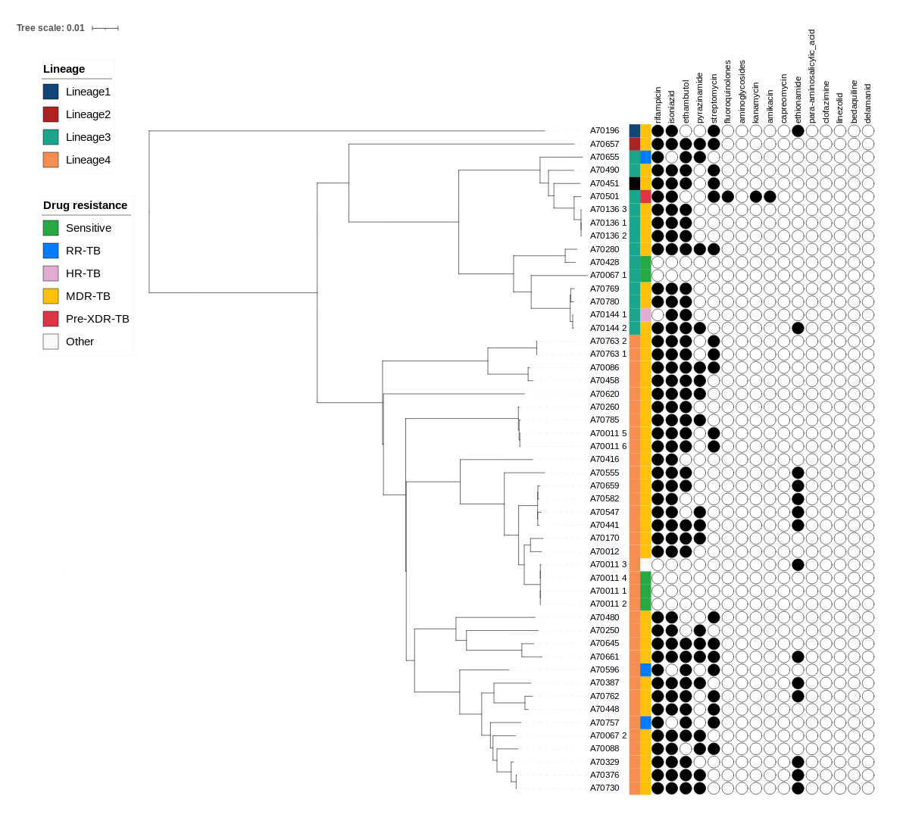

# Phylogenetics

The underlying theme of this practical is the use of genomics in understanding TB drug resistance and strain types. The practical is split into three sections. Each using different programs and with a different data type(s). For each section try to:

* Be familiar with the programs presented and the types of analyses the can perform
* Understand the format of the input/output data
* Understand the conclusions you can draw from the analysis
* Think about how you can apply these concepts to different organisms/scenarios

## Whole genome phylogenetic analysis

In this section we will be generating phylogenetic trees from whole-genome polymorphisms. The dataset consists of 51 M. tuberculosis isolates, which underwent DNA sequencing using Illumina (Genome Analyser II, 76-bp paired-end) technology. Samples were isolated from 41 treatment-experienced TB patients attending a clinic in Kampala, Uganda, including longitudinal samples from five patients and cases of multi drug-resistant TB (MDR-TB). Raw reads were mapped to the H37Rv reference genome using BWA software and subsequently 6857 SNPs inferred employing SAMTOOLS and BCF/VCFTOOLS. By concatenating the SNP locations for the 51 samples, a FASTA formatted dataset (uganda_gen.fasta) has been prepared to read into most phylogenetics software. Here we will be using iqtree to reconstruct the phylogeny.

Phylogenetics is the study of the evolutionary relationships and history among species or groups of organisms. By examining genetic, morphological, and other types of data, scientists construct "trees" that depict these relationships. These trees, called phylogenetic trees or cladograms, represent hypotheses about the patterns of descent among lineages. Branch points, or nodes, on the tree indicate a common ancestor, while the length of branches can sometimes represent time or genetic change. Through phylogenetics, you can trace the lineage of specific species back to their most recent common ancestor and gain insights into evolutionary processes, patterns, and events.

IQ-TREE is a widely-used software tool for the construction of phylogenetic trees using maximum likelihood methods. Developed as an alternative to traditional tools like RAxML and PhyML, IQ-TREE is recognized for its efficiency and speed, especially when handling large datasets. One of its distinguishing features is the ability to automatically determine the best-fitting substitution model, which simplifies the process for users. Additionally, IQ-TREE provides a range of advanced features and supports various types of analyses, making it a versatile choice in evolutionary biology and related fields.

Forst activate the right conda environment:

```
conda activate tb-profiler
```

And then reconstruct the tree use the following command:

```
iqtree -s uganda_gen.fasta
```

Iqtree builds the phylogenetic tree by estimating the genetic distance between all isolates. This is based on the number of SNP differences observed between isolates. Isolates which have more differences between them will be more distantly related and isolates which are more similar have a close recent common ancestor.

Nativate to [https://itol.embl.de/](https://itol.embl.de/) and click on "upload" on the top navbar. Click "browse" and select the file ending in ".treefile" file that you produced using iqtree, followed by “upload”.


There are a few features in itol that we need to be aware of (labelled on the figure above):

1. The contol panel: This is where you can change the way the tree is drawn and make stylistic changes.
2. The sequence IDs: These IDs come from the fasta file used to build the tree
3. The search button: We can search for the position of particular samples of interest using the search function.

On the control panel, click on "Advanced", scroll all the way down and click on "Midpoint root". This will draw tree with the most recent common ancestor to all sequences being placed in the middle of the longest path between any two sequences in the tree.

The identifiers on the right hand side of the tree (e.g. A70659) consist of the patient ID, where multiple samples have been taken from the same patient the ID is suffixed with a number indicating which timepoint (e.g. A70136_1). Isolates sequenced at different time points from the same patient are closely related and cluster together with very short branch lengths among them. This is the case of A70136, A70763 and A70144 patients pointed with green arrows in Figure 3. On the contrary, isolates from patient A70067 and A70011 (red arrows) happen to be placed at distant positions in the tree and having different spoligotypes. In which terms could this be explained? We will now explore this for patient A70067.

You have seen that genome alignments can be used to construct phylogenetic trees to understand the population structure of samples. They tend to cluster by strain-type in the Kampalan set, but this also holds across a global set of samples. *M. tuberculosis* can be classified into nine lineages, including four that are predominant; 1 Indo-Oceanic, 2 East-Asian including Beijing, 3 East-African-Indian, 4 Euro-American. These lineages are postulated to have differential roles in pathogenesis, disease outcome and variation in vaccine efficacy. For example, modern lineages, such as Beijing and Euro-American Haarlem strains exhibit more virulent phenotypes compared to ancient lineages, such as East African Indian.

Here we use the Broad Institute's IGV genomic visualisation tool to consider SNP and structural variation differences between Kampalan Mtb alignments.

Launch the IGV tool (typing `igv` on the command-line)

We will be exploring the genomic data for samples A70067_1 (CAS2, lineage3, September 2003) and A70067_2 (T2, lineage 4, April 2004) which, as discussed in the previous exercise, were isolated from the same patient but are different strains being introduced at different times. We should now load in the BAM files (alignment files) from these two different strains in the previous loaded IGV environment.

Click on File > Load from file... and select the corresponding BAM files (A70067_1.bam and A70067_2.bam). Go to the chromosome region harbouring the Rv3738c gene (coordinates 4,189,463 to 4,190,410 bp) using the Search Box. Type in ‘Rv3738c’ or ‘Chromosome:4,189,463-4,190,410’ in the search box. 

The IGV screen should now be focused on that gene, but try zooming out and in.


**Take a closer look at both the BAM and coverage tracks around _Rv3738c_ gene. A deletion with respect to the reference can be spotted in A70067_1, whilst is absent in A70067_2.** Several signatures are indicative of such event. The most obvious is the lack of read coverage at the region. The presence of read pairs with greater insert size (shown in brown) and badly aligned reads at both breakpoints are indicative of a large deletion too. 

Samples belonging to CAS2 strains (e.g. A70067_1) are reported to have a deletion covering this region while other strains types are not. These regions are often called Regions of Difference (RD), and some RDs and SNPs are associated with strain-types (Coll et al, 2014). 

As shown earlier, Isolates A70067_1 and A70067_2 exhibit different drug susceptibility profiles (see Table 1). Both isolates were tested for Isoniazid (INH) and Rifampicin (RIF) anti-TB drugs, with A70067_1 being susceptible and A70067_2 bi-resistant. 

|      Patient    |     Date      |     SIT     |      Spoligotype family (lineage)    |     Drug     INH RIF    |     Compared      to    |     SNPs      All                  |     DR        |
|-----------------|---------------|-------------|--------------------------------------|-------------------------|-------------------------|------------------------------------|---------------|
|     A70067_1    |     Sep-03    |     288     |     CAS2 (lineage 3)                 |     S  S                |     H37Rv               |     1060 (539)                     |     15 (9)    |
|     A70067_2    |     Apr-04    |     2867    |     T2 (lineage 4)                   |     R  R                |     H37Rv               |     475 (246)                      |     11 (9)    |

Drugs: INH = Isoniazid , RIF=  Rifampicin, R = resistant, S = susceptible; DR = drug resistant candidates. SNP (non-synonymous changes). 

The primary mechanism for acquiring resistance in M. tuberculosis is the accumulation of point mutations (SNPs) in genes coding for drug targets or converting enzymes, and drug resistant disease arises through selection of mutants during inadequate treatment (Zhang & Vilcheze, 2005) or new transmitted resistant strains. **We will investigate polymorphism differences between A70067_1 and A70067_2 isolates in katG (_Rv1908c_, coordinates: 2153896-2156118 bp) and rpoB (_Rv0667_, coordinates: 759810-763328 bp) genes**, known to be associated with INH and RIF resistance respectively.

**Make use of the Search Box functionality again to go to the genes of interest. Try to spot differences between the susceptible and resistant isolates in terms of presence/absence of SNPs**. Note that lineage-specific SNPs may also be present. Table 2 contains drug resistance and lineage-specific SNPs found in the rpoB and katG genes. Mismatches are colour-coded, while nucleotides matching the reference are not. Nevertheless, not all mismatches are to be considered SNPs since some differences are due to sequencing errors. On average, 1 in every 1000 bases in the reads is expected to be incorrect. However, the high depth of coverage achieved by current sequencing platforms means SNPs can be distinguished from sequencing errors. True SNPs are expected to be mismatches occurring consistently across multiple reads at the same reference position, whereas mismatches at spurious locations are likely to be caused by sequencing errors.


|     Gene    |     Locus Name    |     Chromosome position    |     Nucleotide change    |     Amino acid change and codon number    |     Annotation                       |
|-------------|-------------------|----------------------------|--------------------------|-------------------------------------------|--------------------------------------|
|     _katG_    |     _Rv1908c_       |     2155168                |     C/A                  |     S315I                                 |     INH resistance conferring SNP    |
|     _katG_    |     _Rv1908c_       |     2155168                |     C/T                  |     S315N                                 |     INH resistance conferring SNP    |
|     _katG_    |     _Rv1908c_       |     2155168                |     C/G                  |     S315T                                 |     INH resistance conferring SNP    |
|     _katG_    |     _Rv1908c_       |     2154724                |     C/A                  |     R463L                                 |     Non-lineage 4 specific SNP       |
|     _rpoB_    |     _Rv0667_        |     761155                 |     C/T                  |     S450L                                 |     RMP resistance conferring SNP    |
|     _rpoB_    |     _Rv0667_        |     761155                 |     C/G                  |     D450W                                 |     RMP resistance conferring SNP    |
|     _rpoB_    |     _Rv0667_        |     762434                 |     T/G                  |     G876G                                 |     CAS/lineage 3 specific SNP       |
|     _rpoB_    |     _Rv0667_        |     763031                 |     T/C                  |     A1075A                                |     Non-lineage 4 specific SNP       |


## 4. Investigating transmission

Using web-based tools is a great way to run software without the need for installation or knowledge of Linux or the command-line. However, these are often not convenient to use if you have many samples, or don’t have access to the internet. Many of the tools that we have used today are also available as command-line software (or have equivalents). To demonstrate this, we will run tb-profiler on our terminal. 

Before running tb-profiler we will need to activate the environment using the following command:

```
conda activate tb-profiler
```

After this we can run the profiling as we have done using tbdr.lshtm.ac.uk. The following commands will change directory to where the data is and profile the first sample:

```
cd ~/data/tb
tb-profiler profile --read1 A70067_1.fastq.gz --prefix A70067_1 --txt
```

There are a few arguments that we have given:

 - `--read1` : This allows us to specify the input fastq file
 - `--prefix` : This specifies the prefix for the output files
 - `--txt` : This ensures a text output will be created 

!!! question
    Have a look at the output (~/data/tb/results/A70067_1.results.txt). Does it look the same as the profile we got from tbdr.lshtm.ac.uk? 

**Try running the command for A70067_2 by changing the appropriate parameters.**

We can then combine several runs of tb-profiler into a single summary file with the collate function:

```
tb-profiler collate
```

!!! question
    Have a look at the output file ~/data/tb/tbprofiler.txt using a text editor.  Do the profiles look different?

Now we’ll run tb-profiler on all samples. Running it from fastq files can take some time as it must go through all processing steps including trimming, mapping and variant calling. As a result it can take a while to run. Tb-profiler also can take input from vcf files which just contain variants. To run the pipeline using the provided vcfs the command should look like:

```
tb-profiler profile --vcf A70067_1.vcf.gz --prefix A70067_1 --txt
```

Here we have just switched the `--read1` argument for the `--vcf` argument. 

To establish if transmission has occurred, we frequently calculate snp-distance between pairs of samples and pairs with a distance less than a pre-defined cutoff (e.g. 10 snps) can be linked. We can investigate this by telling tb-profiler to calculate snp-distances and save the results of any pairs below a threshold. To do we can add `--snp_dist 20` to the command. We have used a relaxed value of 20 here as we can always make this more stringent after.

Finally, it can be a bit repetitive to run the same command for many isolates. Ideally, we would like to harness the power of automation that is possible on the command-line so that we can profile all samples with just one command. Tb-profiler contains a batch mode that enables you set up your commands using a csv file that tells the pipeline where to look for the input files. To do this we’ll create a csv file using some command-line tools:

```
ls *.vcf.gz | awk 'BEGIN {print "id,vcf"} {print $1","$1}' | sed 's/.vcf.gz//' > vcf_files.csv
```

This will create a csv file with two columns: id and vcf. Have a look at the format by running `head vcf_files.csv`. Now you can tell tb-profiler to run the pipeline for all samples in the csv file by running:

```
tb-profiler batch -csv vcf_files.csv --args "--snp_dist 20"
```

You’ll notice we didn’t give the `--vcf` and `--prefix` arguments as these are read from the csv file. We do have to specify any additional arguments with `--args` followed by the arguments as you would type them for a single sample command.

After it has finished running we can again combine the output files into a single report by running:

```
tb-profiler collate
```

This will produce in addition to the **tbprofiler.txt** output file it will also create a file called **tbprofiler.transmission_graph.json**. We will visualise this we a web-based tool that you can open in your web browser at [https://jodyphelan.github.io/transmission-graph-viewer](https://jodyphelan.github.io/transmission-graph-viewer)

After the page loads click on the upload box and select the .json file. This represents the samples as nodes and where pairs of samples have a snp-distance less or equal to the cutoff an edge will be drawn between them (Figure 10). 

!!! question
    Does this agree with the phylogenetic tree? What happens if you alter the snp-distance cutoff to be more conservative (e.g. 10 SNPs)? What do you think is the best cutoff to use?


{: style="width:50%"}

Finally, the collate command also produces annotation config files that can be used with iTOL. To load the annotations simple drag and drop the following files onto the tree that you loaded earlier:
-	Tbprofiler.lineage.itol.txt – a strip with the main lineage annotated.
-	Tbprofiler.dr.itol.txt – a strip indicating the drug resistance type.
-	Tbprofiler.dr.individ.itol.txt – circles for each individual drug where a solid filled circle indicates resistance.



