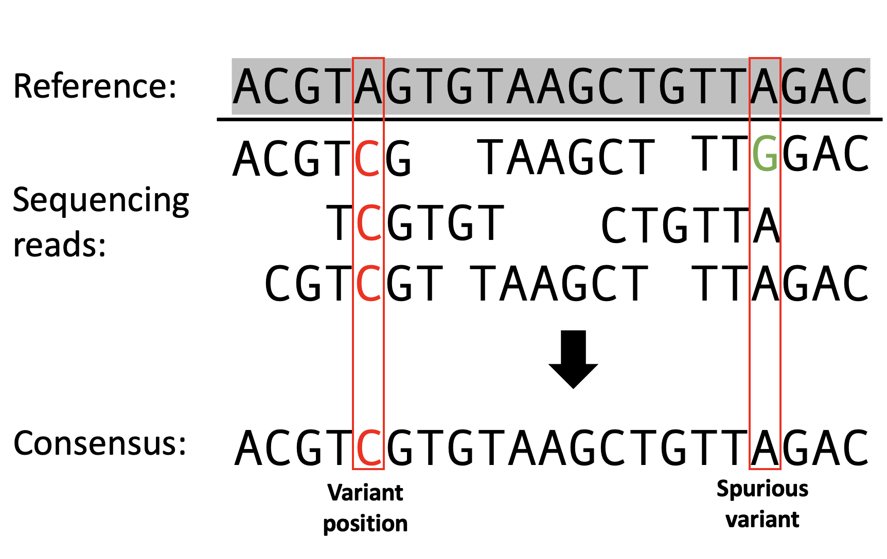
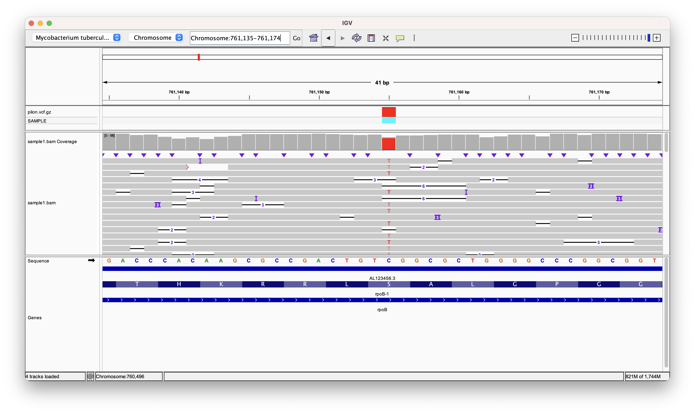
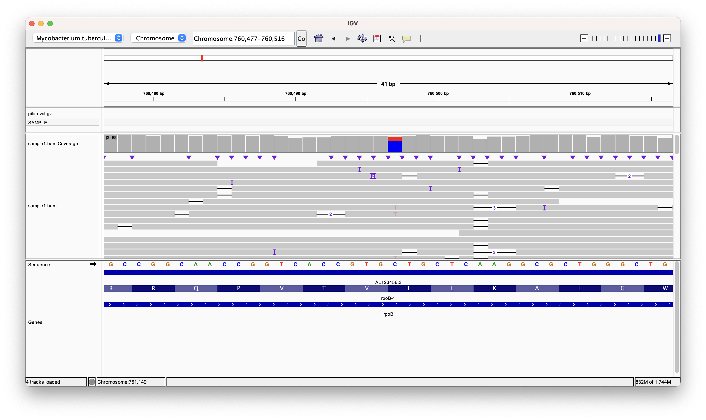

# Variant calling Oxford Nanopore sequencing data

## Intended learning outcomes

This practical session goes into how to perform variant calling on long-read sequencing data from ONT:

1. Learn the concepts behind variant calling
2. ONT data specific tools for variant calling
3. Visualising variants in genomic contexts 

## Background

Variants in genomic data refer to differences in the sequence of DNA or RNA between individuals or between a sample and a reference genome. These differences can manifest as single nucleotide polymorphisms (SNPs), insertions, deletions, or more complex structural variations. Given that you're familiar with sequencing technologies and mapping, let's delve straight into the concept of variant calling, emphasizing its application in Oxford Nanopore sequencing data.



### Variant Calling: A Bird’s-Eye View
Once you've sequenced your DNA sample and mapped the reads onto a reference genome, the next step is to identify where your sample differs from this reference. This process is known as variant calling. Conceptually, it's like comparing two texts and highlighting where they differ. In this genomic context, these differences — or variants — can be tiny, like a single changed letter (a SNP), or larger, like a whole sentence being added or removed (an insertion or deletion).

### Challenges with Oxford Nanopore Sequencing
Oxford Nanopore Technologies (ONT) provides a unique sequencing approach, producing long reads that can span thousands to tens of thousands of bases. This is a game-changer for detecting structural variants and sequencing challenging regions of the genome. However, there's a catch: these long reads come with a higher error rate compared to other sequencing technologies.

The errors introduced during ONT sequencing can be substitutions, insertions, or deletions. This can make variant calling more challenging because we need to differentiate between genuine variants and errors introduced by the sequencing process.

### Preventing False Variants: Strategies to Remember
Given the error-prone nature of Oxford Nanopore sequencing, strategies have been developed to distinguish real variants from sequencing errors:

1. Depth of Coverage: One of the simplest ways to differentiate between true variants and errors is by looking at the depth of coverage. A genuine variant will typically be observed in multiple reads covering the same position, while a sequencing error might only appear in one or a few reads. Sometime we set a hard cut-off, where for example, 70% of the bases at a position would have to support a variant call.

2. Statistical Modeling: Many modern variant callers employ statistical models to evaluate the likelihood that a detected variant is real. These models consider various factors, such as the quality score of the bases in the reads, the depth of coverage, and the expected error rate of the sequencing technology.

3. Using a Combination of Sequencing Technologies: If resources allow, combining the long-read data from ONT with short-read data from platforms like Illumina can provide a more comprehensive and accurate variant landscape. The short-read data, with its lower error rate, can validate variants detected by the long reads. This is called hybrid sequencing analysis, which is very powerful when both long-reads and high-fidelity is required.

4. Repeat & Validate: Especially for critical findings, consider re-sequencing the sample or using a different method (like PCR followed by Sanger sequencing) to validate the identified variants.

### In Conclusion
Variant calling in Oxford Nanopore sequencing data poses unique challenges due to its error-prone nature. But with careful data processing, the use of specialized tools designed for long reads, and strategies to discern real variants from errors, researchers can extract valuable genetic insights from their samples. As with any genomic analysis, it's always a good practice to stay updated with the latest tools and methodologies, and always cross-check critical results for the highest accuracy.

## Activity
We are going to take the three TB samples you mapped in the previous activity and perform variant calling. There are many tools available for variant calling. The most common are [Freebayes](https://github.com/freebayes/freebayes) or [GATK](https://gatk.broadinstitute.org/hc/en-us), but these are used primarily for short-read data. We are going to use nanopore-specific tools. Options include ONT's own [Medaka](https://github.com/nanoporetech/medaka) or [Clair3](https://github.com/HKU-BAL/Clair3/) which both incorporate aspects of the complex basecalling models to avoid making low-frequency or false calls. However, for ease, we will use another tools adapted for variant calling nanopore data called Pilon.

## VCFs

All variant callers create outputs called a Variant Call File (VCF). This file contains variant positions in a BAM alignment, where the reads mapped do not match the reference sequence. The variant caller will scan each position in an alignment and quantify the bases supporting the REF or bases supporting and alternative (ALT) variant call. Below is an example of a VCF, which we will generate in the next step. Take a look at the features and try to understand their importance. 

| #CHROM | POS   | ID     | REF | ALT | QUAL | FILTER | INFO      | FORMAT | Sample1 |
|--------|-------|--------|-----|-----|------|--------|-----------|--------|---------|
| 1      | 12345 | .      | A   | G   | 29   | PASS   | DP=20     | GT     | 0/1     |
| 1      | 67890 | .      | T   | C   | 3    | PASS   | DP=15     | GT     | 1/1     |
| 2      | 54321 | .      | G   | A   | 60   | PASS   | DP=25     | GT     | 0/0     |

1. **`#CHROM` (Chromosome)**
    - Name of the chromosome (e.g., 1-22, X, Y, or MT for humans).

2. **`POS` (Position)**
    - The reference position, starting from 1.

3. **`ID`**
    - Variant identifiers. Defaults to a dot (`.`) if none.

4. **`REF` (Reference Base(s))**
    - Reference base(s) for the variant. For insertions, it's the base before the insertion.

5. **`ALT` (Alternative Base(s))**
    - Comma-separated list of the alternative allele(s). Defaults to a dot (`.`) if none.

6. **`QUAL` (Quality)**
    - Phred-scaled quality score. Defaults to a dot (`.`) if unknown.

7. **`FILTER`**
    - Filters that the variant has passed or failed. "PASS" if all filters are passed. Defaults to a dot (`.`) if filtering hasn't been applied.

8. **`INFO`**
    - Additional information about the variant. Described in meta-information lines (e.g., `##INFO`).

9. **`FORMAT`**
    - Describes the data types and order for the per-sample columns.

10. **`SAMPLE(s)`**
    - Data for each sample. The data types and order are defined in the `FORMAT` field.

## Calling variants for our TB samples
With Pilon, we can set a hard cut-off limit for the variants we accept. Given that we have used nanopore sequencing, we set this high to avoid picking up erroneous variants.

First, you want to activate the relevant conda environment. Activate the **tb-profiler** environment to load all of the programs required for variant calling:

```conda activate tb-profiler```

We want to make sure we are in the folder with all of the alignments you generated in the previous activity. Move to the 'example_data' folder:

```cd ~/data/example_data/```


**Run Pilon now on the three BAMs created in the previous session**

```
pilon -Xmx2g --genome ~/refgenome/tb.fasta --nanopore sample1.bam --variant --output sample1 --mindepth 20
```

We use the `-Xmx2g` argument to provide 2 gb of RAM to pilon. If your VM/computer doesn't have enough RAM this step might fail. 

This command will output every site in the genome including those at which there are no variants and those at which there is a low amount of evidence. To get high quality variants we can extract only those which occur in >70% of the reads.

```
bcftools view -i 'AF>0.7' sample1.vcf > sample1.filt.vcf
```

Now that the variant calling is complete, you can open the VCF files and inspect the variants. If you were writing a paper on the prevalence of mutations in a population, you could use this output to make a table reporting allele frequencies of mutations.

```
less sample1.filt.vcf
```

If you want to view this information as a neater table we can use the bcftools query function which allows you to query the vcf and extract specific information about each variant

```
bcftools query -f '%POS %REF ALT %AF\n'
```

This will extract the position, reference, alternate and the frequency of the alternate allele in the raw data. Bcftools is very useful when you want to extract specific information in a table format that you can then feed into downstream analyses. 

We can visualise the variant calls alongside the mapping data you have created. With IGV open, and your alignment loaded, add the VCF track, and navigate to position 761155. Here we can see where the variant caller has found a position with > 70% of the bases supporting the ALT allele. Navigate to position 760497. Here we can see where a variant has not _made the cut_. In this case, the ALT frequency was < 70%, therefore, it was not included as a variant in our VCF.






## Consequence calling  

Drug resistance in Mtb is cause by mutations in drug targets and drug converting enzymes. Below is a non-exhaustive list of drugs and assosciated resistance genes. 

|     Drug               |     Gene                                         |
|------------------------|--------------------------------------------------|
|     Isoniazid          |     katG, fabG1 promoter, inhA    |
|     Rifampicin         |     rpoB, rpoC                                   |
|     Ethambutol         |     embB, embC, embA,                     |
|     Ethionamide        |     fabG1 promoter, inhA, ethA                  |
|     Pyrazinamide       |     pncA, pncA-Rv2044c                         |
|     Streptomycin       |     rpsL, gid, rrs                           |
|     Aminoglycosides    |     rrs, eis promoter, tlyA                     |
|     Fluroquinolones    |     gyrA, gyrB                                 |
|     Cycloserine      |     alr, ald                                     |
|     PAS                |     thyA, thyX promoter, folC, ribB              |

We will try to look through our variant list to find out if any mutations in these candidate genes exist. The first step in this process is to annotate the gene each mutations is located on. To do this we can use a tool called snpEff which annotates genes and also converts the nucleotide change into protein coding changes. The input is a VCF file and the output is the same VCF with the additional information added using the "ANN" tag in the INFO field. We can run this tool with the following command:

```
snpEff ann Mycobacterium_tuberculosis_h37rv -no-downstream -ud 50 sample1.filt.vcf > sample1.filt.ann.vcf
```

The `-no-downstream` arguments prevents variants from being annotated with downstream gene consequences as these are rarely significant in tb. The `-ud 100` if a variant is upstream of a gene it will only be annotated with that gene if it falls within 100 nucleotides of the start. This  ensures that genes occuring in the promoter of a gene will be annotated correctly but anything further away thatn 100 nt from a gene start is unlikely to have an effect on that gene.


We can again extract the relevant information from the VCF file with  `bcftools query`:

```
bcftools query -f '%POS %REF %ALT %AF %ANN\n' sample1.filt.ann.vcf > sample1.mutations.txt
```

!!! question "Exercise"
    Check this file to see if we have any resistance variants presented in the table below. You can do this by using a tool called `grep` to search for specific text in a file. For example:

    ```
    grep inhA sample1.mutations.txt
    ```

    What pattern of resistance does this sample have?

| Gene | Mutation    | Drug       |
|------|-------------|------------|
| inhA | p.Ile194Thr | isoniazid  |
| inhA | p.Ile21Asn  | isoniazid  |
| inhA | p.Ile21Thr  | isoniazid  |
| inhA | p.Ile21Val  | isoniazid  |
| inhA | p.Ser94Leu  | isoniazid  |
| inhA | p.Ser94Ala  | isoniazid  |
| inhA | p.Ser94Trp  | isoniazid  |
| rpoB | p.Ser450Tyr | rifampicin |
| rpoB | p.Ser450Phe | rifampicin |
| rpoB | p.Ser450Leu | rifampicin |
| rpoB | p.Ser450Met | rifampicin |
| rpoB | p.Ser431Gly | rifampicin |
| rpoB | p.Ser431Thr | rifampicin |
| rpoB | p.Ser431Arg | rifampicin |


